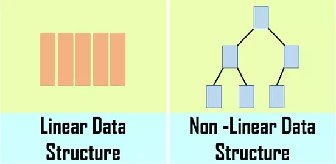

---
{
  "title": "数据结构专题",
}
---

## 数据结构

> 数据结构即数据元素相互之间存在的一种和多种特定的关系集合。

一般你可以从两个维度来理解它，逻辑结构和存储结构。

### 逻辑结构

简单的来说逻辑结构就是数据之间的关系，逻辑结构大概统一的可以分成两种：线性结构、非线性结构。

线性结构：是一个有序数据元素的集合。 其中数据元素之间的关系是一对一的关系，即除了第一个和最后一个数据元素之外，其它数据元素都是首尾相接的。

常用的线性结构有: 栈，队列，链表，线性表。

—非线性结构：各个数据元素不再保持在一个线性序列中，每个数据元素可能与零个或者多个其他数据元素发生联系。

常见的非线性结构有 二维数组，树等。

### 存储结构

逻辑结构指的是数据间的关系，而存储结构是逻辑结构用计算机语言的实现。常见的存储结构有顺序存储、链式存储、索引存储以及散列存储。
例如：数组在内存中的位置是连续的，它就属于顺序存储；链表是主动建立数据间的关联关系的，在内存中却不一定是连续的，它属于链式存储；还有顺序和逻辑上都不存在顺序关系，但是你可以通过一定的方式去放问它的哈希表，数据散列存储。

### 二叉树

- [二叉树-概览](./二叉树/二叉树.md)
- [二叉树的基本操作](./二叉树/二叉树的基本操作.md)⭐⭐
- [二叉树的中序遍历](./二叉树/二叉树的中序遍历.md)⭐⭐
- [二叉树的前序遍历](./二叉树/二叉树的前序遍历.md)⭐⭐
- [二叉树的后序遍历](./二叉树/二叉树的后序遍历.md)⭐⭐
- [重建二叉树](./二叉树/重建二叉树.md)⭐⭐
- [求二叉树的遍历](./二叉树/重建二叉树.html/#求二叉树的遍历)⭐⭐
- [对称的二叉树](./二叉树/对称的二叉树.md)⭐⭐
- [二叉树的镜像](./二叉树/二叉树的镜像.md)⭐⭐
- [二叉搜索树的第k个节点](./二叉树/二叉搜索树的第k个节点.md)⭐⭐
- [二叉搜索树的后序遍历](./二叉树/二叉搜索树的后序遍历.md)⭐⭐
- [二叉树的最大深度](./二叉树/二叉树的最大深度.md)⭐⭐
- [二叉树的最小深度](./二叉树/二叉树的最小深度.md)⭐⭐
- [平衡二叉树](./二叉树/平衡二叉树.md)⭐⭐
- [不分行从上到下打印二叉树](./二叉树/从上到下打印二叉树.html/#题目1-不分行从上到下打印)⭐⭐
- [把二叉树打印成多行](./二叉树/从上到下打印二叉树.html/#题目2-把二叉树打印成多行)⭐⭐
- [二叉树中和为某一值的路径](./二叉树/二叉树中和为某一值的路径.md)⭐⭐⭐
- [二叉搜索树与双向链表](./二叉树/二叉搜索树与双向链表.md)⭐⭐⭐
- [按之字形顺序打印二叉树](./二叉树/从上到下打印二叉树.html/#题目3-按之字形顺序打印二叉树)⭐⭐⭐
- [序列化二叉树](./二叉树/序列化二叉树.md)⭐⭐⭐
- [二叉树的下一个节点](./二叉树/二叉树的下一个节点.md)⭐⭐⭐
- [树的子结构](./二叉树/树的子结构.md)⭐⭐⭐

## 链表

- [链表-概览](./链表/链表.md)
- [删除链表中的节点or重复的节点](./链表/删除链表中的节点or重复的节点.md)⭐⭐
- [从尾到头打印链表](./链表/从尾到头打印链表.md)⭐⭐
- [链表倒数第k个节点](./链表/链表倒数第k个节点.md)⭐⭐
- [反转链表](./链表/反转链表.md)⭐⭐
- [复杂链表的复制](./链表/复杂链表的复制.md)⭐⭐
- [两个链表的第一个公共节点](./链表/两个链表的第一个公共节点.md)⭐⭐
- [圈圈中最后剩下的数字](./链表/圈圈中最后剩下的数字.md)⭐⭐
- [链表中环的入口节点](./链表/链表中环的入口节点.md)⭐⭐⭐

## 字符串

- [替换空格](./字符串/替换空格.md)⭐⭐
- [表示数值的字符串](./字符串/表示数值的字符串.md)⭐⭐
- [字符流中第一个不重复的字符](./字符串/字符流中第一个不重复的字符.md)⭐⭐
- [字符串的排列](./字符串/字符串的排列.md)⭐⭐
- [字符串翻转](./字符串/字符串翻转.md)⭐⭐
- [正则表达式匹配](./字符串/正则表达式匹配.md)⭐⭐⭐

## 栈和队列

- [栈和队列-概览](./栈和队列/栈和队列.md)
- [用两个栈实现队列](./栈和队列/用两个栈实现队列.md)⭐⭐
- [包含min函数的栈](./栈和队列/包含min函数的栈.md)⭐⭐
- [栈的压入弹出序列](./栈和队列/栈的压入弹出序列.md)⭐⭐
- [滑动窗口的最大值](./栈和队列/滑动窗口的最大值.md)⭐⭐⭐

## 数组

- [数组-概览](./数组/数组.md)
- [调整数组顺序使奇数位于偶数前面](./数组/调整数组顺序使奇数位于偶数前面.md) ⭐⭐
- [在排序数组中查找数字](./数组/在排序数组中查找数字.md)⭐⭐
- [数组中出现次数超过数组长度一半的数字](./数组/数组中出现次数超过数组长度一半的数字.md)⭐⭐
- [连续子数组的最大和](./数组/连续子数组的最大和.md) ⭐⭐
- [把数组排成最小的数](./数组/把数组排成最小的数.md) ⭐⭐
- [第一个只出现一次的字符](./数组/第一个只出现一次的字符.md) ⭐⭐
- [扑克牌顺子](./数组/扑克牌顺子.md) ⭐⭐
- [和为S的两个数字](./数组/和为S的两个数字.md) ⭐⭐
- [两数之和](./数组/两数之和.md) ⭐⭐
- [三数之和](./数组/三数之和.md) ⭐⭐⭐
- [四数之和](./数组/四数之和.md) ⭐⭐⭐
- [和为S的连续正整数序列](./数组/和为S的连续正整数序列.md) ⭐⭐⭐
- [构建乘积数组](./数组/构建乘积数组.md) ⭐⭐⭐
- [顺时针打印矩阵](./数组/顺时针打印矩阵.md) ⭐⭐⭐
- [数组中的逆序对](./数组/数组中的逆序对.md)⭐⭐⭐

## 堆
- [堆-概览](./堆/堆.md)
- [堆的基本操作](./堆/堆的基本操作.md)⭐⭐⭐
- [数据流中的中位数](./堆/数据流中的中位数.md)⭐⭐⭐
- [最小的k个数](./堆/最小的k个数.md)⭐⭐⭐

## 哈希表

- [哈希表-概览](./哈希表/哈希表.md)