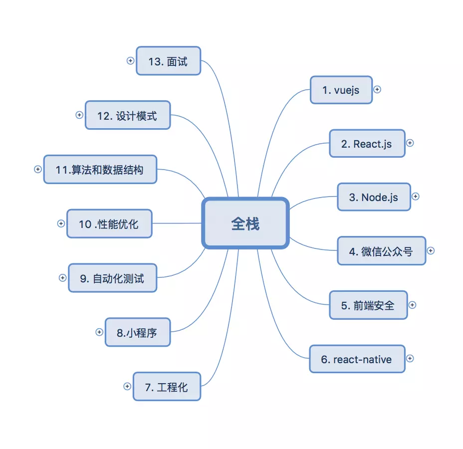
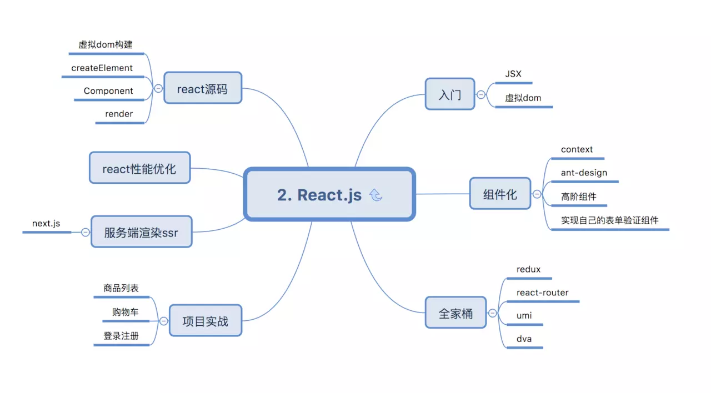
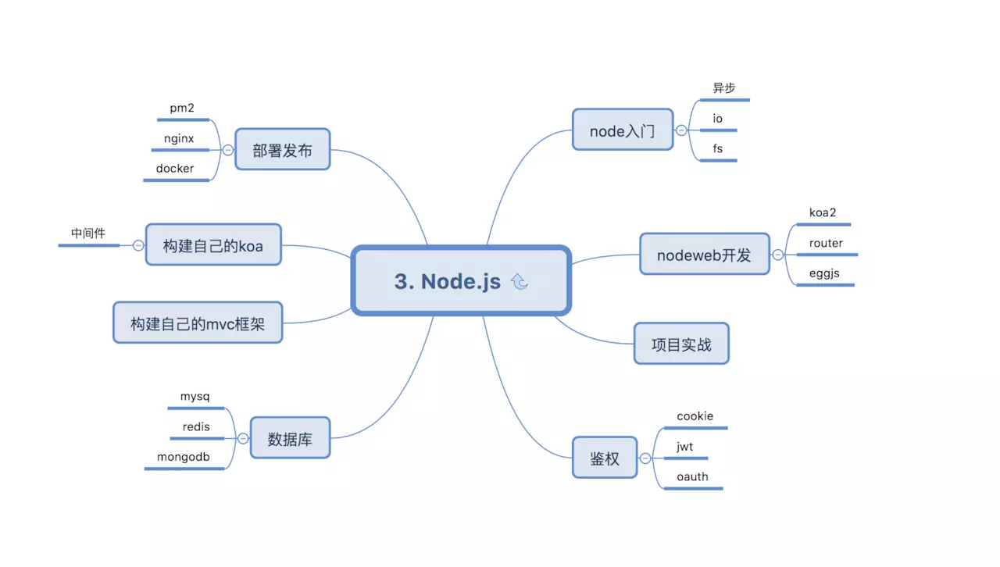
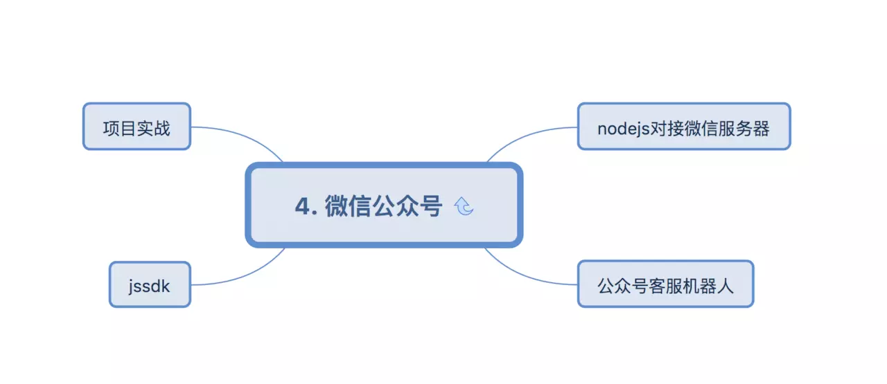
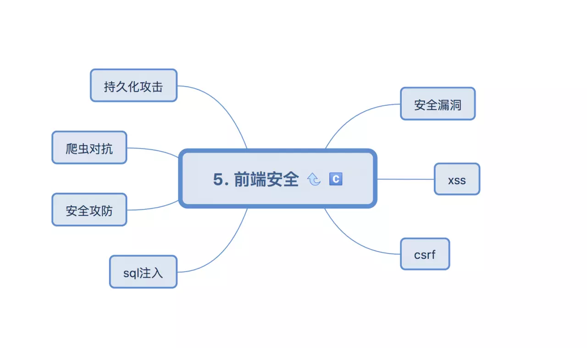
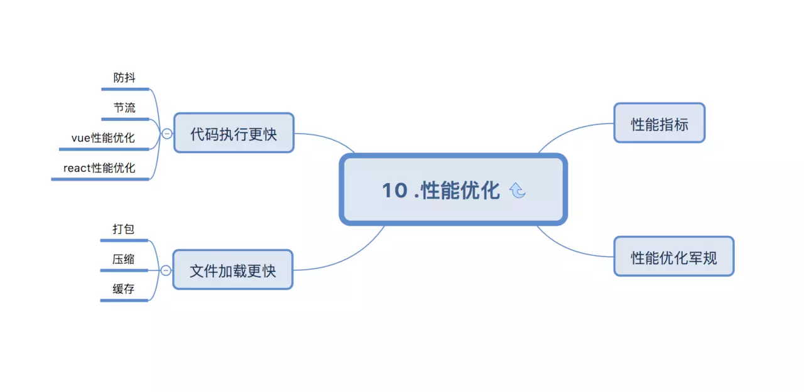
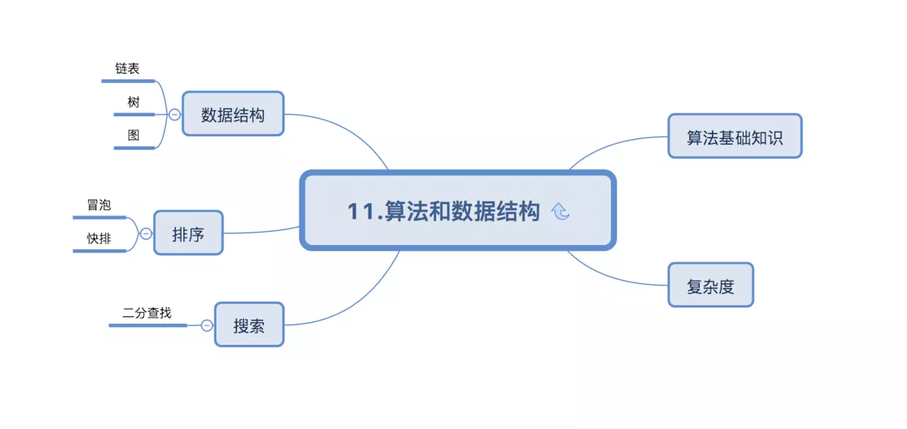
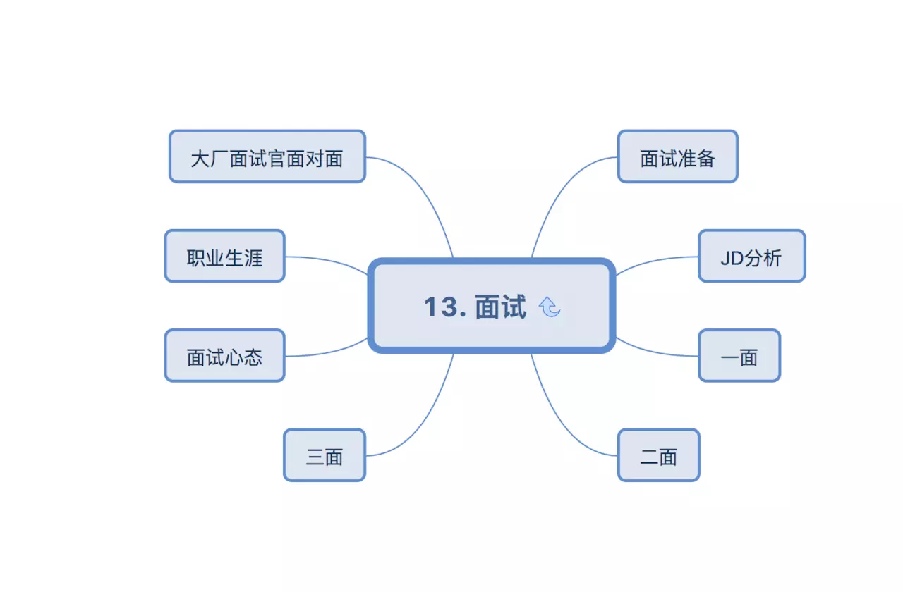

## 前言

以下是从公众号的文章中获取到的一位阿里的前端架构师整理的前端架构p7的技能图谱，当然不是最完整、最系统的。

## 技术架构考核范围

## vue.js

## react.js

## nodejs

## 微信

## 前端安全

## react-native

## 工程化

## 小程序

## 自动化测试

## 性能优化

## 算法和数据结构

## 设计模式

## 面试

